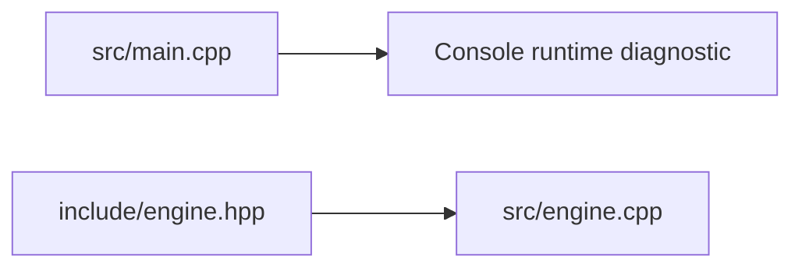
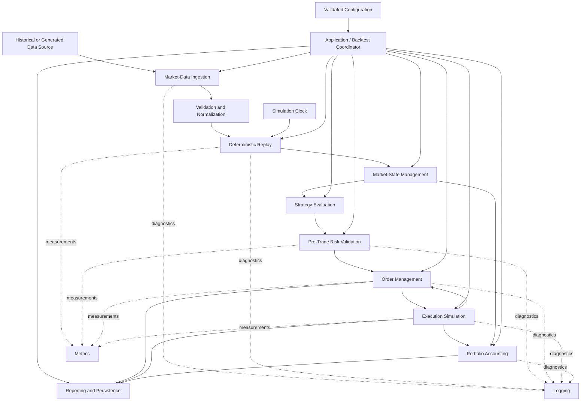
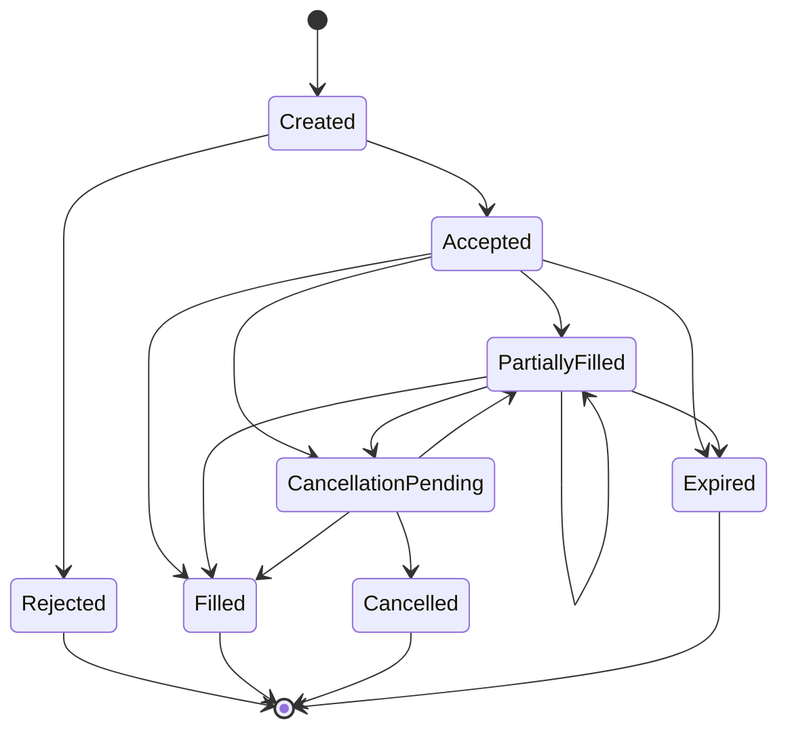
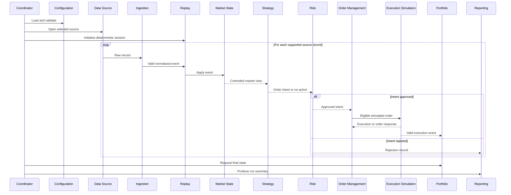
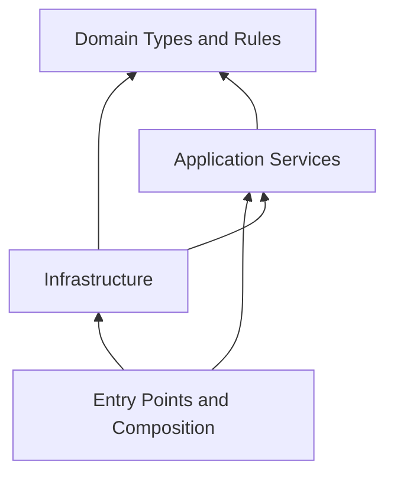

# Hydra-Quant Architecture

## Document Purpose

This document defines the authoritative technical architecture of Hydra-Quant.

It describes:

* the verified current architecture;
* the planned target architecture;
* major subsystem responsibilities;
* expected data flow through the platform;
* interfaces and boundaries between subsystems;
* ownership and lifetime expectations;
* dependency direction;
* configuration, persistence, logging, metrics, and testing infrastructure;
* the proposed concurrency direction;
* error-handling principles;
* deterministic-testing requirements;
* architectural constraints;
* rules for evolving the architecture.

This document does not claim that planned or proposed components are implemented.

The long-term platform vision and requirements are defined in [`BLUEPRINT.md`](BLUEPRINT.md). Implementation sequencing is defined in [`ROADMAP.md`](ROADMAP.md). Confirmed project and architecture decisions are recorded in [`DECISIONS.md`](DECISIONS.md). Verified implementation progress is recorded in [`CURRENT_STATUS.md`](CURRENT_STATUS.md).

## Status Terminology

Hydra-Quant documentation uses the following labels:

* **Implemented** — present in the trusted repository and verified.
* **Planned** — approved as intended future work but not yet implemented.
* **Proposed** — a candidate design that has not been approved.
* **Under evaluation** — actively being investigated or compared.
* **Not yet implemented** — absent from the trusted implementation.

A component shown in a target diagram is not considered implemented unless the trusted repository and [`CURRENT_STATUS.md`](CURRENT_STATUS.md) confirm it.

## Architectural Goals

The architecture should support a platform that is:

* deterministic where repeatability matters;
* explicit about ownership and object lifetime;
* divided into independently testable responsibilities;
* safe against invalid state transitions;
* able to reject malformed external input predictably;
* structured for incremental implementation;
* measurable before optimization;
* understandable to contributors and technical reviewers;
* adaptable without uncontrolled coupling.

The target is not maximum subsystem count. The target is a coherent system whose behavior and tradeoffs can be explained and verified.

## Architecture Summary

Hydra-Quant is intended to become a modular C++20 simulation and backtesting platform.

The target architecture separates:

1. external input;
2. parsing;
3. validation and normalization;
4. deterministic replay;
5. market-state management;
6. strategy evaluation;
7. pre-trade risk validation;
8. simulated order management;
9. execution simulation;
10. portfolio accounting;
11. reporting and observability.

The initial functional platform should remain:

* single-process;
* single-threaded for deterministic simulation;
* synchronous between core subsystems;
* local-data driven;
* command-line operated;
* simulation-only.

Concurrency, advanced market models, custom memory management, network connectivity, and live execution are not part of the initial architecture slice.

## Current Architecture

### Current status

**Implemented**

As of July 18, 2026, Hydra-Quant contains a minimal C++20 project foundation. It is not yet a functional trading platform.

### Current repository components

| Component             | Repository path      | Verified responsibility                                    |
| --------------------- | -------------------- | ---------------------------------------------------------- |
| Build configuration   | `Makefile`           | Compiles source files and links the current executable     |
| Program entry point   | `src/main.cpp`       | Prints a basic runtime diagnostic and exits                |
| Engine declaration    | `include/engine.hpp` | Declares the initial `hydra::CoreEngine` scaffold          |
| Engine implementation | `src/engine.cpp`     | Implements the scaffold constructor and diagnostic method  |
| Test directory        | `tests/`             | Reserved for automated tests                               |
| Shared documentation  | `docs/`              | Contains project-wide technical and planning documentation |

### Current build architecture

The current GNU Make build:

* uses `g++`;
* compiles with C++20;
* enables `-Wall`, `-Wextra`, and `-Werror`;
* reads `.cpp` files from `src/`;
* reads headers from `include/`;
* stores object files in `build/`;
* links an executable named `main`.

The current build system is sufficient for the existing project size.

Continued use of GNU Make as the project expands is **Under evaluation**.

### Current runtime structure



The current executable does not yet assemble or run the planned platform pipeline.

The initial `hydra::CoreEngine` scaffold exists, but the current program entry point does not establish a complete engine lifecycle.

Diagnostic output referring to memory pools, thread pools, or related infrastructure must not be treated as evidence that those systems exist.

### Current architectural limitations

The trusted implementation currently has:

* no domain model for market data or orders;
* no market-data ingestion;
* no validation or normalization pipeline;
* no deterministic replay engine;
* no simulation clock;
* no market-state component;
* no strategy interface;
* no risk engine;
* no order-management system;
* no execution simulator;
* no portfolio accounting;
* no structured configuration;
* no structured logging;
* no metrics subsystem;
* no persistence or reporting layer;
* no automated test framework;
* no benchmark infrastructure;
* no approved concurrency model.

## Target Architecture

### Target status

**Planned**

The target architecture is a layered, event-oriented simulation system with explicit boundaries between domain behavior, application coordination, and external infrastructure.

“Event-oriented” means that normalized domain events drive state changes through defined interfaces. It does not imply that asynchronous communication or multithreading has been approved.

### Target logical view



This diagram represents logical responsibilities.

It does not prescribe:

* one class per component;
* one directory per component;
* one thread per component;
* dynamic allocation for components;
* asynchronous communication;
* a specific dispatch mechanism;
* a final public API.

## Architectural Layers

### Domain layer

**Status: Planned**

The domain layer defines the platform’s core value types, rules, and state-transition concepts.

Expected domain concepts include:

* instrument identifiers;
* prices;
* quantities;
* timestamps;
* market events;
* market views;
* order intents;
* risk decisions;
* orders;
* executions or fills;
* positions;
* simulated cash;
* exposure;
* profit and loss.

The final C++ representations have not yet been approved.

The domain layer should:

* contain minimal infrastructure dependencies;
* avoid direct file access;
* avoid network access;
* avoid direct logging-library dependencies;
* avoid access to global configuration;
* avoid direct operating-system clock access;
* express important invariants explicitly;
* remain usable in deterministic unit tests.

### Application layer

**Status: Planned**

The application layer coordinates domain behavior.

Expected responsibilities include:

* simulation-session coordination;
* deterministic replay coordination;
* market-state updates;
* strategy invocation;
* risk validation;
* order lifecycle coordination;
* execution simulation coordination;
* portfolio updates;
* end-of-run processing.

Application components should depend on domain concepts and narrow interfaces.

They should not depend directly on command-line parsing or source-file layout.

### Infrastructure layer

**Status: Planned**

The infrastructure layer interacts with files, operating-system services, external libraries, and future external systems.

Expected responsibilities include:

* reading local files;
* parsing supported external formats;
* loading configuration;
* writing reports;
* providing logging sinks;
* collecting metrics;
* accessing operating-system timing for benchmarking;
* supporting future network connectivity.

Infrastructure adapts external representations into internal interfaces. It must not define core trading rules.

### Entry-point and composition layer

**Status: Planned**

Application entry points assemble the platform and manage its process lifecycle.

Expected responsibilities include:

* parsing command-line arguments;
* locating configuration;
* loading and validating configuration;
* constructing dependencies;
* validating startup conditions;
* starting a supported command or simulation;
* handling top-level failures;
* coordinating shutdown;
* returning meaningful exit codes.

Entry points should contain composition and process-control logic, not trading algorithms.

## Major Components

### Application and Backtest Coordinator

**Status: Planned**

#### Responsibilities

The coordinator should:

* control startup and shutdown;
* establish a simulation session;
* validate that required components are available;
* initialize deterministic state;
* start replay;
* coordinate end-of-stream behavior;
* request final portfolio and report output;
* expose top-level failures.

#### Boundaries

The coordinator should not:

* parse individual market-data fields;
* implement strategy logic;
* decide risk outcomes;
* modify order state directly;
* decide fill prices;
* implement portfolio accounting rules;
* become a container for unrelated business logic.

#### Ownership expectation

The coordinator is expected to own or control the lifetime of long-lived simulation-session components.

The final construction and dependency-injection pattern is **Under evaluation**.

### Domain Types

**Status: Planned**

#### Responsibilities

Domain types should represent trading concepts explicitly instead of relying on ambiguous combinations of primitive values.

They should support validation of:

* identifiers;
* prices;
* quantities;
* timestamps;
* market-event categories;
* order sides;
* order states;
* execution quantities;
* accounting values.

#### Boundaries

Domain types should not depend on:

* CSV column positions;
* command-line parsing;
* global mutable configuration;
* logging implementations;
* report formats;
* exchange transport logic;
* the real system clock.

#### Open representation decisions

The following remain **Under evaluation**:

* price representation;
* quantity representation;
* timestamp representation;
* instrument-identifier representation;
* event representation;
* order-identifier representation.

### Configuration

**Status: Planned**

#### Responsibilities

Configuration should provide validated settings for:

* data sources;
* instrument selection;
* replay behavior;
* strategy selection and parameters;
* risk limits;
* execution rules;
* initial portfolio state;
* logging behavior;
* output locations;
* benchmark behavior.

#### Boundary rules

Configuration loading and configuration use must be separate.

Core components should receive:

* validated typed settings;
* immutable configuration views;
* or narrow component-specific settings.

Core components should not repeatedly read configuration files or environment variables during deterministic execution.

#### Open configuration decisions

The following are **Under evaluation**:

* configuration-file format;
* command-line override rules;
* environment-variable support;
* schema validation;
* configuration versioning.

### Market-Data Source

**Status: Planned**

#### Responsibilities

A market-data source should expose raw input from a supported source.

Initial sources are expected to be:

* local historical files;
* generated deterministic fixtures.

Possible future sources include:

* additional structured file formats;
* recorded binary data;
* network feeds.

Network sources are **Not yet implemented** and are outside the initial architecture slice.

#### Boundary rules

A market-data source provides input only.

It should not:

* normalize domain events;
* update market state;
* invoke strategies;
* perform risk validation;
* manage orders;
* update portfolio state.

### Market-Data Ingestion

**Status: Planned**

#### Responsibilities

The ingestion component should:

* read supported source records;
* identify record boundaries;
* parse required fields;
* preserve source context for diagnostics;
* report parsing failures;
* pass parsed records to validation and normalization.

#### Boundary rules

Ingestion should not:

* make trading decisions;
* maintain market state;
* invoke strategies;
* approve orders;
* create fills;
* update portfolio state;
* silently substitute values for invalid required fields.

### Validation and Normalization

**Status: Planned**

#### Responsibilities

Validation and normalization should:

* verify required fields;
* validate domain ranges;
* validate supported event forms;
* convert external values into typed domain values;
* apply documented timestamp rules;
* apply documented sequence rules;
* produce normalized internal market events;
* reject invalid records before downstream state changes.

#### Boundary rules

Only validated and normalized events may enter deterministic replay.

Malformed records must not partially update:

* replay state;
* market state;
* strategy state;
* orders;
* portfolio state.

The policy for continuing or terminating after malformed records is **Under evaluation**.

### Simulation Clock

**Status: Planned**

#### Responsibilities

The simulation clock should provide deterministic time to components that require it.

Expected behavior may include:

* returning the current simulated timestamp;
* advancing according to replay events;
* resetting to an initial state;
* supporting deterministic fixtures;
* distinguishing simulated time from operational time.

#### Boundary rules

Components participating in deterministic domain decisions should not read the real system clock directly.

Wall-clock access may be appropriate for:

* operational log timestamps;
* command-line progress display;
* benchmark measurement;
* explicitly nondeterministic infrastructure.

Those uses must not affect deterministic domain outcomes.

### Deterministic Replay

**Status: Planned**

#### Responsibilities

Replay should:

* consume normalized events;
* preserve documented event ordering;
* advance simulated time;
* dispatch each event through the supported processing path;
* provide defined initialization behavior;
* provide defined reset behavior;
* provide defined end-of-stream behavior;
* support deterministic fixtures and regression tests.

#### Boundary rules

Replay should not:

* contain strategy algorithms;
* make risk decisions;
* decide execution outcomes;
* own portfolio accounting rules;
* depend on uncontrolled wall-clock timing.

#### Ordering decisions

The event-ordering policy is **Under evaluation**.

The final policy must define behavior for:

* equal timestamps;
* source sequence numbers;
* multiple instruments;
* duplicate records;
* out-of-order input;
* events earlier than the current replay timestamp;
* records without a usable sequence value.

### Market-State Management

**Status: Planned**

#### Responsibilities

Market-state management should:

* consume normalized market events;
* maintain the market state required by supported simulations;
* enforce documented update rules;
* expose controlled read-only views;
* support deialization and reset.

An initial market-state model may include:

* latest trade;
* latest quote;
* best bid;
* best ask;
* limited event history.

#### Boundary rules

Strategies should observe market state through:

* immutable values;
* immutable snapshots;
* or controlled non-owning read-only views.

Strategies must not mutate shared market state directly.

A full depth-of-book model is **Under evaluation** and is not required for the initial vertical slice.

### Strategy Evaluation

**Status: Planned**

#### Responsibilities

A strategy component should:

* consume a controlled market view;
* consume deterministic simulation time where required;
* maintain strategy-owned state;
* produce explicit order intents;
* support deterministic initialization and reset;
* support isolated testing.

#### Boundary rules

A strategy must not:

* activate an order directly;
* bypass risk validation;
* mutate order-management state;
* generate executions;
* update portfolio accounting;
* read hidden global state;
* depend on uncontrolled randomness;
* depend on wall-clock time.

#### Strategy interface decision

The exact C++ strategy interface is **Under evaluation**.

Possible approaches include:

* concrete strategies composed at build or startup time;
* runtime polymorphism;
* static polymorphism;
* type-erased callables.

No approach is approved until recorded in [`DECISIONS.md`](DECISIONS.md).

### Risk Management

**Status: Planned**

#### Responsibilities

Risk management should:

* receive an order intent;
* inspect the permitted portfolio view;
* inspect the permitted market view;
* apply configured limits;
* return an explicit approval or rejection;
* provide a rejection reason;
* support deterministic rule testing.

Candidate initial checks include:

* valid price and quantity;
* maximum order quantity;
* resulting position;
* maximum notional exposure;
* available simulated capital;
* strategy-specific limits;
* global simulation limits.

#### Boundary rules

Risk management should not:

* generate strategy signals;
* create executions;
* modify market state;
* own order lifecycle state;
* silently alter order intent values unless modification is explicitly designed and documented.

A rejected intent must not enter active order processing.

### Order Management

**Status: Planned**

#### Responsibilities

Order management should own simulated order lifecycle state.

It should:

* assign or accept stable order identifiers;
* create order records after approval;
* validate order-state transitions;
* track original quantity;
* track remaining quantity;
* track cumulative filled quantity;
* process execution responses;
* process cancellation requests;
* expose controlled order snapshots;
* retain or export order history where required;
* reject invalid transitions.

#### Candidate lifecycle

The following lifecycle is **Proposed** and is not approved as the final state machine:



Before implementation, the project must decide:

* which component owns pre-acceptance rejection;
* valid transitions;
* terminal states;
* partial-fill behavior;
* cancellation behavior;
* expiration behavior;
* fill behavior during cancellation;
* order identifier generation;
* invariant enforcement.

#### Boundary rules

Order management owns order state but should not:

* calculate strategy signals;
* approve risk;
* select execution prices;
* calculate portfolio profit and loss;
* parse market-data records.

### Execution Simulation

**Status: Planned**

#### Responsibilities

Execution simulation should:

* receive eligible simulated orders;
* inspect the permitted market view;
* apply documented execution rules;
* produce deterministic execution outcomes;
* support configured no-fill, partial-fill, fill, rejection, and cancellation behavior;
* return execution responses to order management;
* publish valid execution events for portfolio accounting.

#### Boundary rules

Execution simulation should not:

* bypass order-state validation;
* mutate strategy state;
* alter risk configuration;
* modify portfolio state without an explicit execution event;
* use uncontrolled randomness;
* imply market realism beyond its documented model.

#### Model evolution

The first execution model should be simple and explainable.

Possible future models include:

* immediate fills at a documented price;
* spread-aware fills;
* deterministic slippage;
* configurable transaction costs;
* partial fills;
* volume constraints;
* simulated latency.

These are possible future capabilities, not current implementation claims.

### Portfolio Accounting

**Status: Planned**

#### Responsibilities

Portfolio accounting should:

* consume validated execution events;
* update positions;
* update simulated cash;
* maintain average entry price;
* calculate realized profit and loss;
* calculate unrealized profit and loss;
* calculate gross exposure;
* calculate net exposure;
* account for configured transaction costs;
* expose deterministic snapshots and summaries.

#### Boundary rules

Portfolio accounting should not:

* generate strategy signals;
* approve orders;
* decide fills;
* parse source data;
* infer executions from log messages.

Accounting rules must be independently testable.

### Reporting and Persistence

**Status: Planned**

#### Responsibilities

Reporting and persistence may produce:

* order histories;
* execution histories;
* position snapshots;
* portfolio summaries;
* configuration snapshots;
* deterministic event traces;
* benchmark results;
* machine-readable output;
* human-readable summaries.

#### Boundary rules

Persistence should consume explicit records, snapshots, or summaries.

Core domain components should not perform arbitrary file writes.

Persistence must remain outside performance-sensitive paths unless measurement justifies another design.

#### Open persistence decisions

The following are **Under evaluation**:

* output formats;
* generated-output directory structure;
* report versioning;
* storage retention;
* whether storage beyond local files is necessary.

A custom database is not currently planned.

### Logging

**Status: Planned**

#### Responsibilities

Logging should support diagnosis of:

* startup and shutdown;
* configuration failures;
* malformed input;
* replay lifecycle;
* strategy failures;
* risk decisions;
* order transitions;
* execution outcomes;
* portfolio updates;
* invariant violations;
* unrecoverable errors.

#### Boundary rules

Logging must:

* be configurable;
* avoid changing domain outcomes;
* avoid becoming the sole representation of important results;
* avoid exposing secrets;
* have controllable overhead;
* remain distinguishable from deterministic simulation output.

The logging library and structured format are **Under evaluation**.

### Metrics

**Status: Planned**

#### Responsibilities

Metrics may include:

* records read;
* records accepted;
* records rejected;
* events replayed;
* strategy evaluations;
* order intents generated;
* risk approvals;
* risk rejections;
* orders created;
* orders filled;
* orders cancelled;
* executions produced;
* position changes;
* error counts;
* measured component latency;
* measured throughput under a documented workload.

#### Boundary rules

Every metric must have:

* a clear definition;
* a unit;
* an update location;
* a documented interpretation.

Metrics must not be presented as performance evidence without a repeatable benchmark procedure.

### Benchmarking and Profiling

**Status: Planned**

#### Responsibilities

Benchmark infrastructure should support focused measurement of:

* parsing;
* normalization;
* replay dispatch;
* market-state updates;
* strategy invocation;
* risk validation;
* order-state transitions;
* execution simulation;
* accounting updates;
* allocation behavior.

#### Boundary rules

Benchmarks must remain separate from correctness tests.

Benchmark results should identify:

* hardware environment;
* operating system;
* compiler version;
* build flags;
* workload or dataset;
* warm-up behavior where applicable;
* sample count;
* measurement units;
* measurement method;
* known limitations.

### Testing Infrastructure

**Status: Planned**

The `tests/` directory exists, but no automated test framework is currently implemented.

#### Unit-test responsibilities

Unit tests should verify:

* domain invariants;
* parsing;
* validation;
* normalization;
* replay ordering;
* market-state update rules;
* strategy reset behavior;
* risk rules;
* order transitions;
* execution rules;
* accounting rules;
* failure behavior.

#### Integration-test responsibilities

Integration tests should verify:

* source to parsed record;
* parsed record to normalized event;
* normalized event to replay;
* replay to market-state update;
* market state to strategy intent;
* strategy intent to risk decision;
* risk approval to order creation;
* order processing to execution;
* execution to portfolio update;
* complete deterministic scenarios.

#### Planned test support

Test support may include:

* fixed simulation clocks;
* deterministic market-data fixtures;
* temporary files;
* deterministic strategy doubles;
* execution-model doubles;
* in-memory record collectors;
* in-memory logging sinks;
* portfolio-state fixtures;
* generated invalid-input cases.

The test framework is **Under evaluation**.

## Expected Data Flow

### Market-Data Path

**Status: Planned**

```text id="9p46kb"
Local historical or generated source
    -> raw record
    -> parsing
    -> field validation
    -> domain validation
    -> normalized market event
    -> deterministic replay
    -> market-state update
```

Rules:

* invalid records stop before normalization;
* only normalized events enter replay;
* replay order must be documented;
* market-state changes occur through the market-state component;
* source-format details must not leak into strategy logic.

### Strategy Path

**Status: Planned**

```text id="jjv5ef"
Normalized event
    -> market-state update
    -> controlled market view
    -> strategy evaluation
    -> order intent or no action
```

Rules:

* strategy input must be deterministic during deterministic runs;
* strategy output is an intent, not an active order;
* strategy code must not bypass risk validation;
* strategy-owned state must support reset.

### Risk-Management Path

**Status: Planned**

```text id="1i9ihs"
Order intent
    + risk configuration
    + portfolio view
    + permitted market view
    -> risk decision
```

Expected result categories include:

* approved;
* rejected with reason;
* invalid request.

Rules:

* rejection is a normal domain outcome;
* rejected intents cannot reach execution;
* risk decisions must be reproducible;
* risk rules must be testable independently.

### Order-Management and Execution Path

**Status: Planned**

```text id="ayh9r0"
Approved order intent
    -> order creation
    -> valid order-state transition
    -> execution simulation
    -> execution response
    -> order-state update
    -> validated execution event
    -> portfolio update
```

Rules:

* order management owns order lifecycle;
* execution simulation owns fill-decision rules;
* portfolio accounting consumes validated execution facts;
* cumulative fill quantity cannot exceed valid order quantity;
* terminal order states cannot return to active states.

### Simulation and Backtesting Path

**Status: Planned**



This sequence is conceptual.

The final implementation may combine or split calls while preserving the same responsibilities and constraints.

## Interfaces and Boundaries

The exact C++ interfaces are not finalized.

The following conceptual contracts define the intended dependency boundaries.

| Producer                     | Consumer                     | Conceptual data               |
| ---------------------------- | ---------------------------- | ----------------------------- |
| Market-data source           | Ingestion                    | Raw record or byte sequence   |
| Ingestion                    | Validation and normalization | Parsed external record        |
| Validation and normalization | Replay                       | Normalized market event       |
| Replay                       | Market-state management      | Ordered market event          |
| Market-state management      | Strategy                     | Controlled market view        |
| Strategy                     | Risk management              | Order intent                  |
| Risk management              | Order management             | Approved intent               |
| Risk management              | Reporting or observability   | Rejection result              |
| Order management             | Execution simulation         | Eligible simulated order      |
| Execution simulation         | Order management             | Execution or order response   |
| Execution simulation         | Portfolio accounting         | Valid execution event         |
| Portfolio accounting         | Reporting                    | Portfolio snapshot or summary |
| Components                   | Logging                      | Diagnostic record             |
| Components                   | Metrics                      | Defined measurement update    |

### Interface requirements

Interfaces should:

* use typed inputs and outputs;
* define ownership expectations;
* define lifetime expectations;
* document failure behavior;
* minimize hidden global state;
* avoid exposing mutable internal containers;
* support deterministic tests;
* remain narrow enough to replace infrastructure in tests.

### Mutation rules

Direct mutation across subsystem boundaries is prohibited.

Examples:

* strategies must not mutate portfolio state;
* risk management must not mutate strategy state;
* execution simulation must not mutate strategy state;
* persistence must not mutate active order state;
* logging must not alter domain decisions;
* metrics must not alter domain decisions;
* entry points must not bypass validation or state-transition rules.

## Ownership and Lifetime Model

### Architectural direction

**Planned and consistent with confirmed RAII requirements**

Hydra-Quant should use explicit hierarchical ownership.

### Expected hierarchy

```text id="5s28cu"
Application entry point
    owns
Application or backtest coordinator
    owns or controls
Simulation-session components
    own
Subsystem-specific state and resources
```

### Long-lived simulation objects

A simulation session may contain:

* validated configuration;
* simulation clock;
* data source;
* replay coordinator;
* market state;
* strategy;
* risk manager;
* order manager;
* execution simulator;
* portfolio;
* reporting service;
* logging service;
* metrics service.

The exact composition structure remains **Under evaluation**.

### Domain data ownership

Market events, order intents, risk decisions, executions, and snapshots should generally use value semantics where practical.

Value semantics support:

* clear ownership;
* deterministic copying or movement;
* simpler tests;
* reduced lifetime coupling;
* easier persistence.

### Dynamic ownership rules

Preferred rules:

* use automatic storage duration where practical;
* use `std::unique_ptr` for exclusive polymorphic ownership;
* use references for required non-owning dependencies;
* use pointers for optional non-owning dependencies with clear lifetimes;
* use `std::shared_ptr` only when shared lifetime is necessary and documented;
* do not use raw owning pointers.

### Lifetime restrictions

The architecture should avoid:

* references to temporary objects;
* stored references that may outlive their owners;
* global mutable service registries;
* hidden ownership transfer;
* cyclic ownership;
* shared ownership as a default;
* detached asynchronous work;
* background work that outlives its simulation session;
* destruction order that depends on undocumented behavior.

### Resource ownership

Files, handles, threads, locks, buffers, and other managed resources must use RAII-based ownership.

Resource release must not depend on every caller remembering a manual cleanup operation.

## Concurrency and Threading Model

### Current status

**Under evaluation**

No production concurrency model is implemented or approved.

### Initial planned model

The first functional platform should use:

* one process;
* one deterministic simulation thread;
* ordered event processing;
* synchronous core subsystem calls;
* explicit startup and shutdown;
* no background work required for correctness.

This model simplifies:

* ownership;
* state transitions;
* debugging;
* deterministic testing;
* failure handling;
* replay reproducibility.

### Possible future model

The following is **Proposed**, not approved:

```text id="iy6ceq"
Input thread
    -> bounded input queue

Simulation thread
    -> replay
    -> market state
    -> strategy
    -> risk
    -> orders
    -> execution
    -> portfolio

Output thread
    -> logging
    -> reporting or persistence
```

Other threading models may be evaluated after profiling.

### Requirements before concurrency is introduced

A concurrency change must define:

* thread ownership;
* shared state;
* synchronization primitives;
* queue ownership;
* queue capacity;
* backpressure behavior;
* shutdown sequence;
* cancellation behavior;
* error propagation;
* deterministic-test strategy;
* race-detection strategy;
* measured performance benefit.

### Unapproved concurrency techniques

The architecture must not assume that the following are required or beneficial:

* one thread per subsystem;
* thread pools;
* lock-free queues;
* custom schedulers;
* CPU affinity;
* asynchronous logging;
* busy waiting;
* custom memory-ordering policies.

These remain **Under evaluation**.

## Error-Handling Architecture

### Current status

**Principles approved; project-wide mechanism Under evaluation**

Errors should be categorized by meaning.

### Error categories

| Category                           | Example                           | Architectural treatment                   |
| ---------------------------------- | --------------------------------- | ----------------------------------------- |
| Configuration error                | Missing required setting          | Fail startup with actionable context      |
| External-input error               | Malformed record                  | Reject according to documented run policy |
| Domain rejection                   | Risk limit exceeded               | Return normal rejection result            |
| Invalid transition                 | Fill after terminal order state   | Reject and expose invariant failure       |
| Recoverable infrastructure error   | Optional report cannot be written | Report according to configured policy     |
| Unrecoverable initialization error | Required source cannot be opened  | Stop before simulation begins             |
| Internal invariant violation       | Impossible quantity or state      | Fail visibly and never continue silently  |

### Interface requirements

Public interfaces should document:

* whether failure is expected;
* how failure is represented;
* whether state may have changed;
* whether partial results are possible;
* whether exceptions may propagate;
* whether retry is valid.

### Exception safety

Operations that may modify state should define their exception-safety expectations.

Where practical:

* validation should complete before mutation;
* failed operations should not leave partially valid state;
* resource acquisition should use RAII;
* destructors should not emit recoverable failures through exceptions;
* top-level exceptions should be translated into meaningful process failure.

### Mechanism under evaluation

The project-wide use of:

* exceptions;
* result types;
* status objects;
* optional values;
* error codes;

is **Under evaluation**.

Different layers may use different mechanisms when justified, but public behavior must remain consistent and documented.

## Deterministic Testing Architecture

Deterministic testing is a primary architectural requirement.

### Controlled inputs

Tests should control:

* input records;
* event order;
* simulation time;
* random seeds;
* strategy state;
* risk configuration;
* execution rules;
* initial portfolio state;
* output collection.

### Replaceable external effects

The following should be replaceable, injectable, or otherwise controllable where practical:

* simulation clocks;
* file sources;
* randomness;
* logging sinks;
* metrics sinks;
* persistence sinks;
* future network clients.

### Repeatability rule

Given identical:

* tested executable or component;
* input data;
* configuration;
* initial state;
* controlled dependencies;

the test should produce identical observable domain results.

### Observable deterministic outputs

Depending on the test, observable results may include:

* normalized event order;
* market-state snapshots;
* strategy intents;
* risk decisions;
* order histories;
* execution records;
* position state;
* cash state;
* profit and loss;
* report contents;
* selected logs;
* selected metrics.

### Concurrency testing

If concurrency is introduced, correctness tests must not depend only on sleeping or timing assumptions.

Concurrent components must provide:

* controllable synchronization;
* bounded test behavior;
* explicit shutdown verification;
* race-detection support;
* stress testing separate from deterministic unit tests.

## Dependency Direction

Dependencies should point toward stable domain concepts.



### Dependency rules

* domain types must not depend on entry points;
* domain rules must not depend on source-file formats;
* domain rules must not depend on concrete logging libraries;
* strategies must not depend on concrete persistence;
* risk rules must not depend on command-line parsing;
* portfolio accounting must not depend on reporting formats;
* infrastructure may adapt external representations into domain types;
* entry points may depend on concrete implementations to assemble the application;
* tests may depend on public interfaces and explicit test support.

### Dependency ownership

An abstraction should generally be owned by the layer that requires the behavior, not by the external implementation that supplies it.

For example:

* deterministic clock behavior is required by simulation logic;
* a file-based source is an infrastructure implementation;
* reporting receives domain or application results rather than defining them.

### Cyclic dependencies

Cyclic dependencies between logical subsystems are prohibited.

Where two components appear to require each other, the design should consider:

* a smaller shared domain type;
* an explicit event;
* an interface owned by the more stable layer;
* a coordinator responsible for sequencing;
* separating commands from results.

## Cross-Cutting Boundaries

Configuration, logging, metrics, and persistence must not become unrestricted global services.

### Configuration boundary

Components receive only the settings they require.

They should not repeatedly query a global mutable configuration object.

### Logging boundary

Components may emit diagnostics through a narrow interface.

Logging must not own or mutate domain state.

### Metrics boundary

Metrics may observe and count behavior but must not affect trading decisions.

### Persistence boundary

Persistence consumes explicit snapshots, records, or event streams.

Persistence must not own active trading state unless a future recorded decision changes the architecture.

### Clock boundary

Simulation time and operational time must remain distinct.

Deterministic domain behavior uses the simulation clock.

Benchmark and operational infrastructure may use monotonic or wall-clock time without affecting simulation outcomes.

## Architectural Constraints

### Language and platform

* C++20 is the approved language standard.
* Ubuntu Linux is the primary development environment.
* Supported builds must enable strong compiler warnings.
* Warnings are treated as errors.

### Correctness

* undefined behavior is prohibited;
* invalid states should be prevented or detected;
* state transitions must be explicit;
* malformed external input must not silently enter the domain model;
* risk-rejected intents must not execute;
* portfolio accounting must derive from validated execution events.

### Ownership

* RAII is required for managed resources;
* ownership transfer must be explicit;
* raw owning pointers are prohibited;
* global mutable state requires explicit architectural approval;
* shared ownership requires documented justification.

### Determinism

* deterministic paths must not depend on real current time;
* randomness must be controlled;
* event ordering must be documented;
* deterministic tests must not depend on thread scheduling;
* container iteration order must not affect observable results unless explicitly normalized.

### Performance

* optimization follows measurement;
* benchmarks must be reproducible;
* correctness tests and performance tests remain separate;
* specialized allocators require evidence;
* lock-free structures require evidence;
* logging and persistence overhead must be controllable;
* performance claims require documented workloads and environments.

### Modularity

* each subsystem must have a primary responsibility;
* direct cross-subsystem mutation is prohibited;
* infrastructure details must not leak into strategy logic;
* interfaces must document lifetime and failure behavior;
* dependency cycles are prohibited.

### Security and operations

* secrets must not be committed;
* external input must be treated as untrusted;
* network connectivity must remain isolated from domain rules;
* simulation must remain clearly separated from any future live execution;
* live trading requires a separate architecture and governance decision.

### Documentation

* implemented behavior must match documentation;
* proposed mechanisms must be labeled;
* unresolved choices must remain open decisions;
* architecture changes must update this file;
* consequential approved changes must be recorded in [`DECISIONS.md`](DECISIONS.md).

## Architecture Evolution Rules

### Rule 1: Introduce boundaries when behavior requires them

A subsystem should not be created only because it appears in the target diagram.

A boundary should provide one or more of:

* independent responsibility;
* isolated testability;
* controlled ownership;
* reduced coupling;
* a justified replacement point;
* measurable value.

### Rule 2: Prefer complete vertical slices

Prefer a complete path such as:

```text id="9540b1"
local input
    -> parsed record
    -> validated event
    -> deterministic replay
    -> observable result
```

over multiple disconnected subsystem skeletons.

### Rule 3: Keep interfaces minimal

Interfaces should expose only behavior required by verified use cases.

Do not design large speculative APIs for:

* unimplemented exchanges;
* distributed deployment;
* unsupported order types;
* future user interfaces;
* hypothetical plugin ecosystems.

### Rule 4: Record consequential decisions

A change should be recorded in [`DECISIONS.md`](DECISIONS.md) when it affects:

* language or build tooling;
* domain representation;
* component boundaries;
* ownership;
* error handling;
* threading;
* persistence;
* third-party dependencies;
* determinism;
* benchmark methodology.

### Rule 5: Preserve deterministic testability

Architecture changes must not remove deterministic testability without an explicit replacement strategy.

### Rule 6: Measure performance changes

Performance-motivated architectural changes require:

* a representative workload;
* a baseline;
* a repeatable measurement;
* recorded results;
* documented tradeoffs.

### Rule 7: Avoid premature infrastructure

Do not introduce the following without a verified requirement:

* distributed services;
* databases;
* message brokers;
* custom allocators;
* lock-free queues;
* plugin systems;
* dependency-injection frameworks;
* networking abstraction layers;
* custom thread schedulers.

### Rule 8: Keep status accurate

When implementation changes the verified architecture, update:

* [`CURRENT_STATUS.md`](CURRENT_STATUS.md);
* this document;
* [`README.md`](../README.md) when the public summary changes;
* [`ROADMAP.md`](ROADMAP.md) when milestone status changes;
* [`DECISIONS.md`](DECISIONS.md) when a consequential decision is finalized.

## Planned Architecture Evolution

### Foundation to typed ingestion

The first expansion should establish:

* typed market-data values;
* a supported local source;
* parsing;
* validation;
* normalization;
* deterministic fixtures;
* an automated test framework.

### Typed ingestion to replay

The next expansion should establish:

* event-ordering rules;
* simulation-clock behavior;
* replay lifecycle;
* reset behavior;
* deterministic observable output.

### Replay to strategy

The next expansion should establish:

* controlled market-state views;
* a strategy interface;
* one deterministic example strategy;
* explicit order intents;
* strategy reset behavior.

### Strategy to risk and order management

The next expansion should establish:

* risk-decision types;
* initial risk rules;
* order identifiers;
* an approved order-state model;
* valid transition enforcement.

### Orders to execution and accounting

The next expansion should establish:

* a simple execution model;
* execution events;
* order fill updates;
* position accounting;
* simulated cash accounting;
* end-to-end deterministic tests.

### Integrated simulation to measured optimization

Only after the complete vertical slice is correct and tested should the architecture expand toward:

* structured metrics;
* benchmark targets;
* profiling;
* allocation analysis;
* data-layout changes;
* concurrency experiments;
* richer execution models.

## Open Architecture Decisions

The following topics remain unresolved.

They must not be treated as approved until recorded in [`DECISIONS.md`](DECISIONS.md).

### Domain representation

* price representation;
* quantity representation;
* timestamp representation;
* instrument identifiers;
* normalized event representation;
* order identifiers;
* profit-and-loss numeric representation.

### Build and dependency management

* continued use of GNU Make;
* possible migration to CMake;
* third-party dependency policy;
* test-framework selection;
* benchmark-framework selection;
* sanitizer integration.

### Interfaces

* strategy polymorphism model;
* event-dispatch mechanism;
* market-state view representation;
* coordinator composition pattern;
* execution-model interface;
* reporting interface.

### Error handling

* exception policy;
* result or status type;
* invariant-failure policy;
* malformed-record continuation policy;
* report-write failure policy.

### Data and persistence

* initial market-data schema;
* configuration format;
* output formats;
* generated-output directory structure;
* persistence requirements beyond local files.

### Concurrency

* whether concurrency is required;
* thread boundaries;
* queue model;
* backpressure;
* shutdown coordination;
* CPU affinity;
* lock-free structures;
* asynchronous logging.

### Performance

* representative benchmark workloads;
* measurement tooling;
* optimized-build flags;
* regression methodology;
* allocator strategy;
* acceptable environmental variance.

## Architecture Acceptance Checklist

A new subsystem or major architecture change should answer the following questions before integration.

### Responsibility

* What primary responsibility does it own?
* What responsibilities are explicitly outside its scope?
* Does another component already own this behavior?

### Interfaces

* What inputs does it accept?
* What outputs does it produce?
* How are failures represented?
* Are mutable internals exposed?
* Are source-format details leaking inward?

### Ownership

* Who owns the component?
* Who owns its inputs and outputs?
* Can any reference outlive its owner?
* Is dynamic allocation necessary?
* Is shared ownership justified?

### Determinism

* Does it access wall-clock time?
* Does it use randomness?
* Does iteration order affect results?
* Can it be initialized and reset predictably?
* Can identical tests produce identical outputs?

### Concurrency

* Is the component synchronous?
* Does it create background work?
* What shared state exists?
* How does shutdown work?
* How are races detected?

### Testing

* What unit tests verify it?
* What failure cases are covered?
* What integration boundary does it participate in?
* Are corrected defects protected by regression tests?

### Performance

* Is the change performance motivated?
* What workload was measured?
* What baseline exists?
* What result justifies the complexity?
* What maintenance cost was introduced?

### Documentation

* Is the component status labeled accurately?
* Does this document require an update?
* Does [`CURRENT_STATUS.md`](CURRENT_STATUS.md) require an update?
* Does [`ROADMAP.md`](ROADMAP.md) require an update?
* Does [`DECISIONS.md`](DECISIONS.md) require a decision record?

## Architecture Maintenance

Update this document when:

* a major subsystem is implemented;
* a planned boundary changes;
* a major interface is approved;
* domain ownership changes;
* the threading model changes;
* the error-handling policy is finalized;
* dependency direction changes;
* a cross-cutting service is introduced;
* a major architectural constraint changes.

Routine task progress belongs in [`CURRENT_STATUS.md`](CURRENT_STATUS.md) and [`ROADMAP.md`](ROADMAP.md).

Confirmed choices belong in [`DECISIONS.md`](DECISIONS.md).

Changes to this document must not weaken or override governance established in:

* [`../AGENTS.md`](../AGENTS.md);
* [`../CODEX.md`](../CODEX.md);
* [`DEVELOPMENT.md`](DEVELOPMENT.md);
* `../CLAUDE.md` after that file is created.
